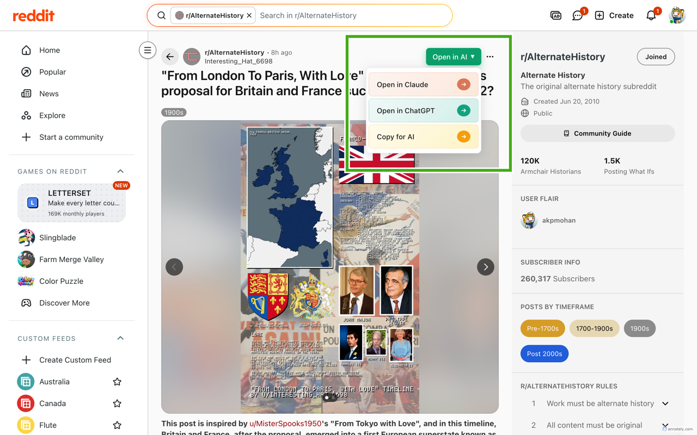
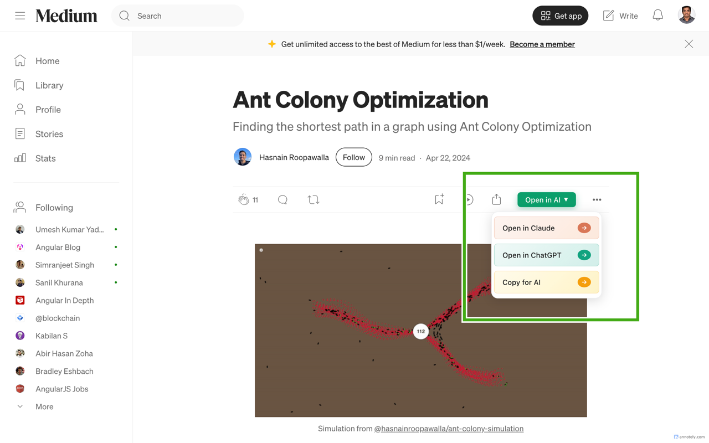
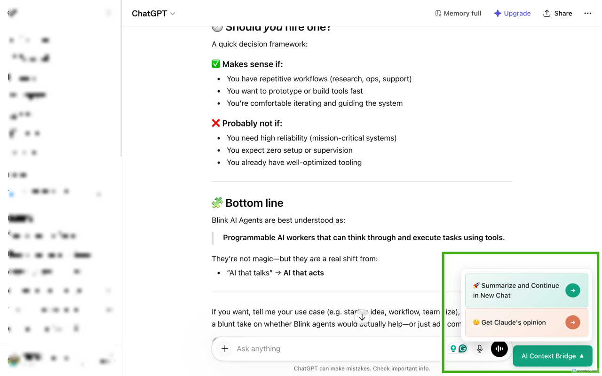
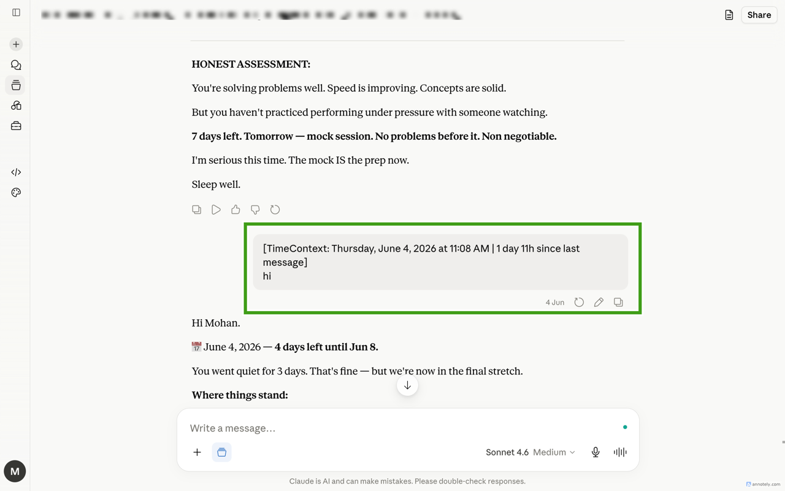
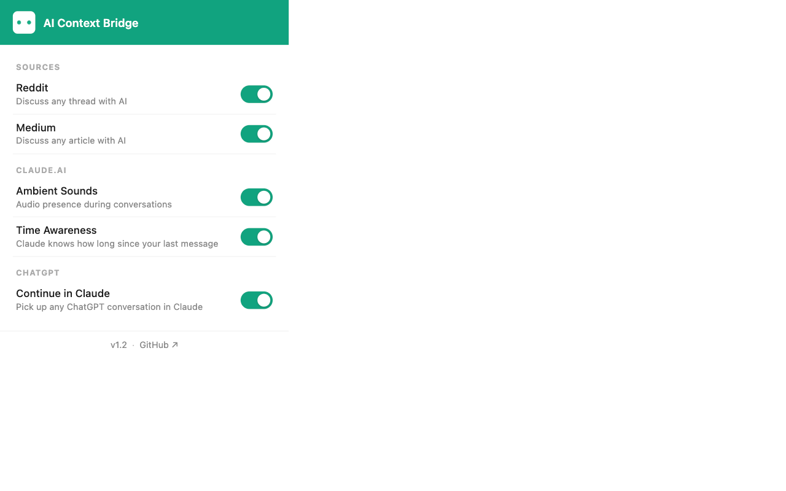

# AI Context Bridge

> One click sends Reddit threads, Medium articles & ChatGPT conversations to Claude or ChatGPT. No copy-paste, full context preserved.

<a href="https://opensource.org/licenses/Apache-2.0" target="_blank"></a>
<a href="https://chromewebstore.google.com/detail/ai-context-bridge/kjgmboacclalfjgcmooplnpimjalikfo" target="_blank"></a>

## Screenshots

| Reddit | Medium |
|--------|--------|
|  |  |

| ChatGPT | Claude.ai |
|---------|-----------|
|  |  |

| Popup |
|-------|
|  |

## What it does

AI Context Bridge is a Chrome extension that bridges content from the web into your AI conversations — without copy-pasting.

**Sources → Destinations:**
- Reddit thread → Claude or ChatGPT
- Medium article → Claude or ChatGPT
- ChatGPT conversation → Claude (summarize & continue, or get a second opinion)

Plus two extras on Claude.ai:
- **Ambient sounds** — subtle audio presence during conversations
- **Time awareness** — Claude knows how long since your last message

## Installation

**Chrome Web Store (recommended):**
<a href="https://chromewebstore.google.com/detail/ai-context-bridge/kjgmboacclalfjgcmooplnpimjalikfo" target="_blank">Install AI Context Bridge</a>

**Manual:**
1. Clone or download this repo
2. Open `chrome://extensions/` → enable Developer mode
3. Click "Load unpacked" → select this folder

## Features

### Sources

**Reddit**
An "Open in AI ▼" button appears on any Reddit thread. Click to choose:
- Open in Claude — sends the full thread with top comments
- Open in ChatGPT — same, but opens in ChatGPT
- Copy for AI — copies formatted context to clipboard

**Medium**
Same dropdown appears on any Medium article.

### ChatGPT

A floating button appears on ChatGPT conversations:
- **Summarize and Continue** — asks ChatGPT to summarize the conversation, then opens Claude with that summary pre-loaded
- **Get Claude's Opinion** — sends the conversation to Claude for a second take

### Claude.ai

**Ambient Sounds** — plays subtle background audio (breath, hum, chime) while Claude is thinking or responding. Toggle in the popup.

**Time Awareness** — automatically prepends a time context tag to your message when you've been away for 30+ minutes. Claude knows it's been a while. Toggle in the popup.

## Privacy

All processing is local. The extension reads page content only when you click a button. No data is sent to any server. No tracking.

## Architecture

```
ai-context-bridge/
├── manifest.json
├── background.js                  # Service worker — monitors ChatGPT API responses
├── content-script.js              # ChatGPT page
├── claude-content-script.js       # Claude.ai page
├── reddit-content-script.js       # Reddit pages
├── medium-content-script.js       # Medium pages
├── popup.html / popup.js / popup.css
└── src/
    ├── core/                      # schema, budget trimmer, formatter
    ├── ai-platforms/              # claude.js, chatgpt.js
    ├── content-sources/           # reddit.js, medium.js
    ├── ui/                        # theme.js, floating-button.js, menu-injector.js
    ├── presence/                  # ambient sound state machine
    └── time/                      # message-timer.js
```

See <a href="CLAUDE.md" target="_blank">CLAUDE.md</a> for full architecture details and contribution guide.

## Contributing

1. Fork the repo
2. Make changes — no build step, pure JS loaded directly by Chrome
3. Reload the extension in `chrome://extensions/` to test
4. Submit a pull request

## License

Apache 2.0 — see <a href="LICENSE" target="_blank">LICENSE</a>

---

Made with ❤️ for the AI community

Product Engineer: <a href="https://www.linkedin.com/in/mohankumarsm/" target="_blank">Mohan</a> · Developer: <a href="https://github.com/claude" target="_blank">Claude Code</a> · <a href="https://github.com/akpmohan07/ai-context-bridge/issues" target="_blank">GitHub Issues</a>
